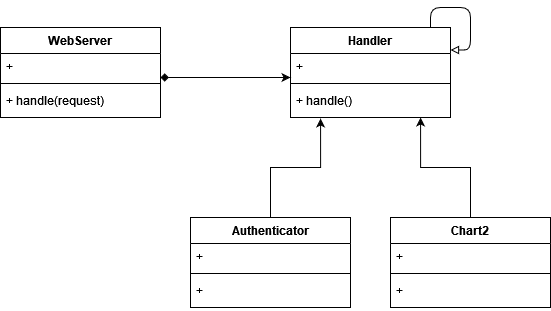

# Chain of Responsibility

A design pattern that lets you pass requests along a sequence of handlers. As each request is received, each handler decides whether to process the request or pass it along the chain.

