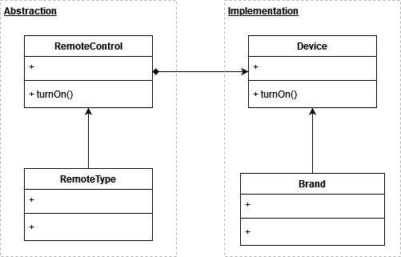

# Bridge

A design pattern that that lets you split a large class (or a set of closely related classes) into two separate hierarchies, abstraction and implementation, which can be developed independently of each other.

